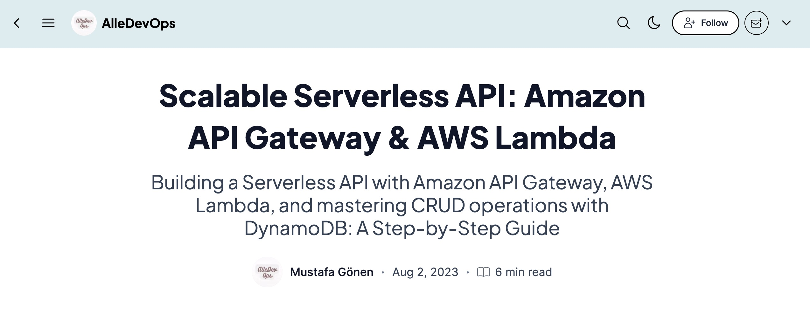
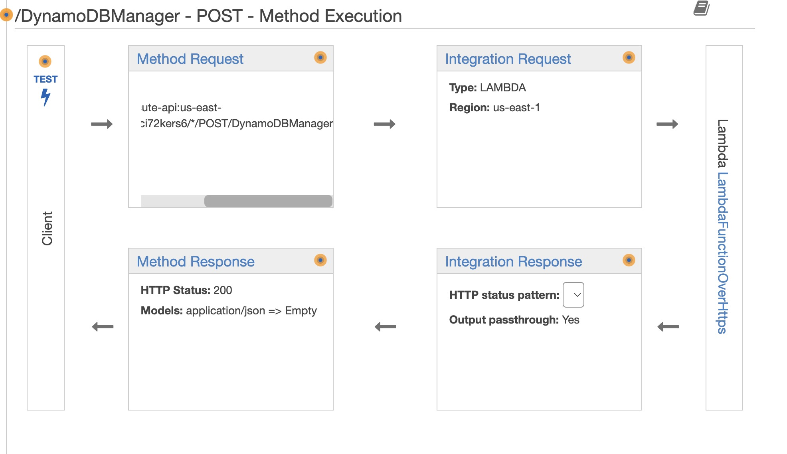

# Building a Serverless API with Amazon API Gateway, AWS Lambda, and DynamoDB

## Project Summary
Our goal is to **create a powerful serverless API that interacts with DynamoDB to perform CRUD operations** and supports additional operations for testing. 

The API will be backed by an *AWS Lambda function*, which will handle incoming requests and interact with the *DynamoDB table* based on the payload. This project aims to showcase how to build a scalable and cost-efficient *serverless API* using AWS services.

## Technologies Used
- **Amazon API Gateway**
- **AWS Lambda**
- **AWS DynamoDB**
- **AWS IAM**
- **Postman**
- **CloudFormation**
- **Terraform**

## Project Architecture
The project consists of **three main components**:
1. **Amazon API Gateway:** Serves as the frontend for the API, routing HTTP requests to the appropriate Lambda function.
2. **AWS Lambda:** A Python 3.7 Lambda function acts as the backend, handling various operations and interacting with the DynamoDB table.
3. **DynamoDB:** The NoSQL database service stores data, and I create a table with a primary key for efficient data retrieval.

## Deployment and Infrastructure as Code (IaC) 
**_--UPDATED--_**

This project now embraces a refined approach to deployment and Infrastructure as Code (IaC) by incorporating both **AWS CloudFormation** and **Terraform**.

### AWS CloudFormation

The AWS CloudFormation template is located in the `infra/cfn` folder. It defines all the necessary resources, including the Lambda function, API Gateway, and DynamoDB table. You can customize the template to suit your specific requirements.

The provided one-click deployment URL simplifies the process, allowing you to deploy the complete application stack effortlessly with just a single click:

[One-Click Deployment](https://us-east-1.console.aws.amazon.com/cloudformation/home#/stacks/quickcreate?templateUrl=https://serverless-api-gateway-lambda-dynamodb.s3.amazonaws.com/cloudformation-template.yaml&stackName=serverless-api-gateway-lambda-dynamodb)

Upon successful stack creation, the **Endpoint URL of the deployed API** becomes accessible via the **"Outputs"** tab within the **CloudFormation console**. This facilitates the testing of the serverless API. Furthermore, reference to **sample payloads** can be located within the design narrative blog post (See Implementation Guide).

### Terraform

The Terraform configurations are now organized in the `infra/terraform` folder. This provides an alternative IaC method for managing and provisioning infrastructure resources. You can explore and modify the Terraform configurations based on your specific needs.

## Monitoring and Alerting
To monitor the application and *infrastructure health*, we use **AWS CloudWatch**. CloudWatch gathers and displays *performance metrics*, *logs*, and *events*. By analyzing these metrics and logs, we can identify potential issues and performance bottlenecks.

## Security and Compliance
We implement **fine-grained access control** using *IAM roles* and *policies*. Additionally, we encrypt sensitive data *at rest* and *in transit*. 

## Implementation Guide

To implement the project step by step using the AWS Management Console, you can follow this **project design narrative** in my **blog website**: https://alledevops.com/scalable-serverless-api-amazon-api-gateway-aws-lambda

The guide provides detailed instructions on *how to set up* the serverless API with Amazon API Gateway, AWS Lambda, and DynamoDB. It covers everything from *creating* the necessary *AWS resources* to *testing* the API endpoints manually.

## Overcoming Challenges

During the course of project development, several challenges arose, particularly in *configuring the AWS API Gateway*. Notably, **two main hurdles** were encountered when dealing with POST requests through tools like Postman:

1. **"Missing Authentication Token"**: Establishing communication with the API Gateway led to recurring "missing authentication token" errors, prompting an in-depth investigation for resolution.

2. **"Internal Server Error"**: The project encountered intermittent "internal server error" issues, which required thorough troubleshooting to uncover the root causes.

After dedicated exploration, a key insight emerged: *API Gateway operation relied not only on the IAM role but also necessitated explicit lambda permissions within the resource policy*. This realization effectively addressed the **"missing authentication token"** challenge.

Upon manual resource implementation through the console, the project exhibited smooth functionality. This included seamless data creation in the DynamoDB table and effortless retrieval using tools like Postman and curl.

However, *transitioning to automated deployment via a cloudformation template introduced complexity*. The deployment process encountered **stack rollback** instances. To address this, a comprehensive analysis of API Gateway console, Postman, and CloudWatch **logs** was conducted. The issue stemmed from inconsistencies in the **API Gateway method execution** configuration within the template. *The solution involved meticulous alignment of the cloudformation template with the prescribed structure*, a nuanced and time-intensive process.

In conclusion, these challenges highlighted **the intricacies of setting up an effective API Gateway**. They underscored the importance of perseverance and deep comprehension to successfully navigate and conquer such hurdles.

## Room for Growth
While the current implementation of the serverless API project provides a solid foundation, there are several areas where the project can be further improved and expanded. Here are some ideas to enhance the project:

1. **Continuous Integration and Continuous Deployment (CI/CD)**
Integrating a CI/CD pipeline can streamline the development process, automate testing, and ensure seamless deployments. By setting up CI/CD workflows, developers can automatically run tests on each code change, perform code quality checks, and deploy new changes to different environments (e.g., staging and production). Popular CI/CD tools like Jenkins, GitHub Actions, or AWS CodePipeline can be leveraged to build and deploy the project automatically.

2. **Improved Monitoring and Alerting**
To enhance observability and performance monitoring, implement advanced monitoring and alerting using AWS CloudWatch or other monitoring tools. Set up custom metrics, alarms, and dashboards to gain insights into API performance, Lambda function execution times, and DynamoDB throughput. This will help identify potential bottlenecks and ensure the application's reliability.

3. **Enhanced Security Features**
For robust security, consider implementing additional security features. Enforce strict IAM roles and policies to grant least privilege access to AWS resources. Enable AWS Key Management Service (KMS) encryption for sensitive data stored in DynamoDB. Implement API Gateway Usage Plans and API Keys for better control over API access. Additionally, enable AWS Web Application Firewall (WAF) to protect against common web exploits.

4. **Integration Testing and Test Coverage**
Add comprehensive integration tests to validate the entire system end-to-end. Use test frameworks like Pytest to create test suites for API operations, covering various scenarios and edge cases. Aim for high test coverage to ensure code reliability and minimize potential issues in the future

## Conclusion
Building a serverless API with Amazon API Gateway, AWS Lambda, and DynamoDB provides a scalable and cost-efficient solution for modern applications. By following this project's principles and best practices, developers can create robust and maintainable serverless applications that scale effortlessly with user demands.

## References
- GitHub Repository: https://github.com/saha-rajdeep/serverless-lab
- AWS Documentation: 
  - https://repost.aws/knowledge-center/api-gateway-authentication-token-errors
  - https://repost.aws/knowledge-center/api-gateway-internal-server-error
- Blog Post: https://alledevops.com/scalable-serverless-api-amazon-api-gateway-aws-lambda
